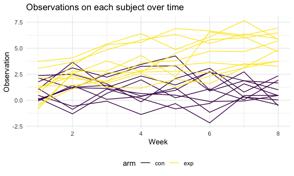
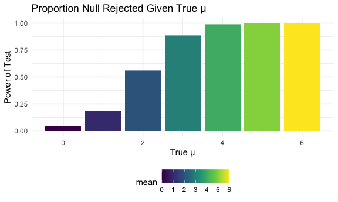
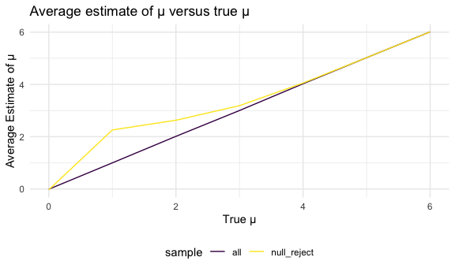

p8105\_hw5\_kl3181
================
Kelley Lou

## Problem 1

Read in the data and clean.

``` r
homicide_df = 
  read.csv("./homicide_data/homicide-data.csv") %>% 
  mutate(
    resolved = case_when(
      disposition == "Closed without arrest" ~ "unsolved",
      disposition == "Open/No arrest" ~ "unsolved",
      disposition == "Closed by arrest" ~ "solved"
    ),
    city_state = str_c(city, state, sep = "_")
  ) %>% 
  select(city_state, resolved) %>% 
  filter(city_state != "Tulsa_AL")
```

Create aggregate DF

``` r
aggregate_df = 
  homicide_df %>% 
  group_by(city_state) %>% 
  summarize(
    hom_total = n(),
    hom_unsolved = sum(resolved == "unsolved")
  )
```

    ## `summarise()` ungrouping output (override with `.groups` argument)

Proportion test for a single city

``` r
prop.test(
  aggregate_df %>% filter(city_state == "Baltimore_MD") %>% pull(hom_unsolved),
  aggregate_df %>% filter(city_state == "Baltimore_MD") %>% pull(hom_total)) %>% 
  broom::tidy()
```

    ## # A tibble: 1 x 8
    ##   estimate statistic  p.value parameter conf.low conf.high method    alternative
    ##      <dbl>     <dbl>    <dbl>     <int>    <dbl>     <dbl> <chr>     <chr>      
    ## 1    0.646      239. 6.46e-54         1    0.628     0.663 1-sample… two.sided

Iteration for all cities

``` r
results_df = 
  aggregate_df %>% 
  mutate(
     prop_tests = map2(.x = hom_unsolved, .y = hom_total, ~prop.test(x = .x, n = .y)),
     tidy_tests = map(.x = prop_tests, ~broom::tidy(.x))
   ) %>% 
  select(-prop_tests) %>% 
  unnest(tidy_tests) %>% 
  select(city_state, estimate, conf.low, conf.high)
```

``` r
results_df %>% 
  mutate(city_state = fct_reorder(city_state, estimate)) %>% 
  ggplot(aes(x = city_state, y = estimate)) +
  geom_point() +
  geom_errorbar(aes(ymin = conf.low, ymax = conf.high)) +
  theme(axis.text.x = element_text(angle = 90, vjust = 0.5, hjust = 1))
```


## Problem 2

Tidy the data\!

``` r
path_df = 
  tibble(
    path = list.files("lda_data")
  ) %>% 
  mutate(
    path = str_c("lda_data/", path),
    data = map(path, read_csv)) %>% 
  unnest(data) %>%
  separate(path, into = c("folder", "arm"), sep = 9) %>%
  separate(arm, into = c("arm", "id"), sep = "_") %>% 
  separate(id, into = c("id", "na"), sep = 2) %>% 
  select(-folder, -na) %>% 
  pivot_longer(
    week_1:week_8,
    names_to = "week", 
    values_to = "observation",
    names_prefix = "week_"
  ) %>%
  mutate(
    id = str_remove(id, "^0+"),
    week = as.numeric(week),
    subject_id = str_c(arm, id, sep = "_")
    ) %>% 
  select(-id)

path_df
```

    ## # A tibble: 160 x 4
    ##    arm    week observation subject_id
    ##    <chr> <dbl>       <dbl> <chr>     
    ##  1 con       1        0.2  con_1     
    ##  2 con       2       -1.31 con_1     
    ##  3 con       3        0.66 con_1     
    ##  4 con       4        1.96 con_1     
    ##  5 con       5        0.23 con_1     
    ##  6 con       6        1.09 con_1     
    ##  7 con       7        0.05 con_1     
    ##  8 con       8        1.94 con_1     
    ##  9 con       1        1.13 con_2     
    ## 10 con       2       -0.88 con_2     
    ## # … with 150 more rows

Making a spaghetti plot

``` r
path_df %>% 
  ggplot(aes(x = week, y = observation, color = arm, group = subject_id)) +
  geom_path() +
  labs(
    title = "Observations on each subject over time",
    x = "Week", 
    y = "Observation"
  )
```



Observations appear to be more similar between the two treatment arms at
the beginning of the study, and increase in range of observations as the
weeks go by. The experimental group seems to have larger observations
which increase over time while the control group seems to stay
consistent with quite a bit of variation for each study subject.

## Problem 3

Creating the t-test function.

``` r
t_test = function(sample_size = 30, mu, sigma = 5) {
  simulation = 
    tibble(x = rnorm(n = sample_size, mean = mu, sd = sigma))
  simulation %>% 
  t.test() %>% 
  broom::tidy()
}
```

Setting mu equal to 0

``` r
sim_results = 
  rerun(5000, t_test(mu = 0)) %>% 
  bind_rows()

sim_results %>% 
  select(estimate, p.value)
```

    ## # A tibble: 5,000 x 2
    ##    estimate p.value
    ##       <dbl>   <dbl>
    ##  1    0.207   0.837
    ##  2   -0.720   0.513
    ##  3    0.579   0.520
    ##  4    0.322   0.657
    ##  5    0.223   0.795
    ##  6   -0.759   0.423
    ##  7    1.05    0.316
    ##  8    0.199   0.838
    ##  9    1.70    0.137
    ## 10   -1.01    0.269
    ## # … with 4,990 more rows

Repeating for means 1 to 6.

``` r
rep_sim_results = 
  tibble(mean = c(0, 1, 2, 3, 4, 5, 6)) %>% 
  mutate(
    output_lists = map(.x = mean, ~rerun(5000, t_test(mu = .x))),
    estimate_dfs = map(output_lists, bind_rows)) %>% 
  select(-output_lists) %>% 
  unnest(estimate_dfs)

rep_sim_results %>% 
  select(mean, estimate, p.value)
```

    ## # A tibble: 35,000 x 3
    ##     mean estimate p.value
    ##    <dbl>    <dbl>   <dbl>
    ##  1     0   -1.74   0.0588
    ##  2     0   -0.581  0.500 
    ##  3     0   -0.548  0.579 
    ##  4     0   -1.24   0.136 
    ##  5     0   -1.03   0.189 
    ##  6     0    0.984  0.396 
    ##  7     0   -1.02   0.219 
    ##  8     0   -0.949  0.368 
    ##  9     0    1.14   0.232 
    ## 10     0    1.85   0.0383
    ## # … with 34,990 more rows

Making a plot to show proportion of times the null was rejected on the y
axis and true value of µ on the x axis.

``` r
rep_sim_results %>% 
  select(mean, estimate, p.value) %>% 
  group_by(mean) %>% 
  summarize(prop_reject = sum(p.value <= 0.05) / n()) %>% 
  ggplot(aes(x = mean, y = prop_reject, fill = mean)) +
  geom_bar(stat = 'identity') +
  labs(
    title = "Proportion Null Rejected Given True µ",
    x = "True µ",
    y = "Power of Test"
  )
```

    ## `summarise()` ungrouping output (override with `.groups` argument)



We can see that the power of the test increases as we increase the true
mean further from 0. This makes sense that the further away the true
mean is, the more times we would reject the null.

Making a plot showing the average estimate of µ on y axis and true value
of µ on x axis overlaid on a plot showing the average estimate of µ only
in samples for which the null was rejected on the y axis on the true
value of µ on the x axis.

``` r
all_samples = 
  rep_sim_results %>% 
    select(mean, estimate, p.value) %>% 
    group_by(mean) %>% 
    summarize(all = mean(estimate))
```

    ## `summarise()` ungrouping output (override with `.groups` argument)

``` r
rejected_samples = 
  rep_sim_results %>% 
    select(mean, estimate, p.value) %>% 
    filter(p.value <= 0.05) %>% 
    group_by(mean) %>% 
    summarize(null_reject = mean(estimate))
```

    ## `summarise()` ungrouping output (override with `.groups` argument)

``` r
left_join(all_samples, rejected_samples, by = "mean") %>% 
  pivot_longer(
    all:null_reject,
    names_to = "sample",
    values_to = "average_estimate"
  ) %>% 
  ggplot(aes(x = mean, y = average_estimate, color = sample)) +
  geom_line() +
  labs(
    title = "Average estimate of µ versus true µ",
    x = "True µ",
    y = "Average Estimate of µ"
  )
```



We can see that when we include all samples, the average estimate of µ
correlates very well with the true µ. However, when we include only
samples that have been rejected, the sample average of µ is not equal to
the true value of µ especially when the true value of µ is closer to 0.
